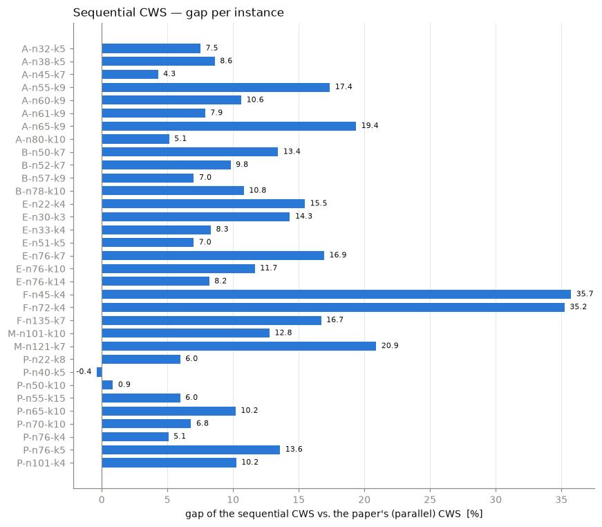

# Capacitated Vehicle Routing Problem

Lab activity on the CVRP: a fleet of identical vehicles of capacity `Q` leaves a single
depot, every customer `i` must be served exactly once with its demand `q_i`, and the total
distance travelled is minimised.

```
min  Σ_routes Σ_{(i,j)∈route} d_ij
s.t. every customer on exactly one route,
     Σ_{i∈route} q_i ≤ Q  for every route,
     every route starts and ends at the depot
```

**Assignment** (course slides, `docs/02b VRP and CWS Heuristic 2026.pptx.pdf`): write a
3-page paper that describes the Clarke & Wright savings heuristic (CWS), implements it for
the VRP, tests it on the benchmark instances and compares the results with Table 1 of
Juan et al. (2011), with the code as an appendix.

> **State: in progress.** The **sequential** CWS is implemented and run on the 33
> instances. Next: the **parallel** CWS (the version used in the paper), then the article.

## Scope relative to the paper

The project follows the **assignment**, not the paper. Juan et al. (2011) present
SR-GCWS-CS, a metaheuristic built on top of the CWS; their Table 1 is used here only as
the reference for the comparison. How far the implementation goes with respect to the main
procedure of the paper (Figure 4):

| Figure 4 | Step of SR-GCWS-CS | Here |
|---|---|---|
| line 1 | `makeSavingsList` — sorted savings list | yes, `make_savings_list` |
| line 2 | `constructCWSSol` — classic CWS, parallel version (column `CWS Sol.` of Table 1) | sequential version done; parallel version next |
| lines 3–4, 8 | multi-start loop of `constructRandomSol`: CWS with the edge chosen at random by a geometric distribution (Figures 5–6) | no |
| line 5 | `improveSolUsingRoutesCache` — hash table with the best order of every route (Figure 7) | no |
| lines 6–7 | `improveSolUsingSplitting` — solve sub-problems on regions of the plane (Figures 3, 8) | no |

The construction loop has the structure of Figure 5 (take an edge, find the routes of its
two nodes, check the merging conditions, merge, delete the edge) but always takes the
**first** edge of the list, which is what turns the randomised CWS back into the classic
one. The comparison target is therefore the column `CWS Sol.` of Table 1; the column
`Our Best Sol.` comes from the whole SR-GCWS-CS and is out of scope.

## Method

Clarke & Wright savings heuristic:

1. Compute the saving of every pair of customers, `s(i,j) = c(0,i) + c(0,j) − c(i,j)`,
   with unrounded Euclidean distances, and sort the pairs by decreasing saving.
2. Start from the dummy solution: one route `0 → i → 0` per customer.
3. Walk the savings list and merge the routes of `i` and `j` through the edge `(i, j)`
   when the CWS conditions hold: different routes, `i` and `j` both adjacent to the depot,
   and joint load `≤ Q`.

The **sequential** version grows one route at a time: the first feasible edge of the list
seeds a route, which is then extended with the first feasible edge touching it until none
is left; the route is closed and the next one is started. The **parallel** version (to do)
lets any two routes merge at any moment in a single pass over the list.

## Results — sequential CWS

Mean gap per family (`gap = 100 · (cost − ref) / ref`) against the CWS cost reported by
Juan et al. (parallel version) and against the best-known solution (BKS, real distances).
Full table in [`results/sequential_cws.csv`](results/sequential_cws.csv).

| Family | Instances | Gap vs. paper CWS (%) | Gap vs. BKS (%) |
|---|---|---|---|
| A | 8 | 10.10 | 15.55 |
| B | 4 | 10.27 | 12.59 |
| E | 7 | 11.70 | 17.19 |
| F | 3 | 29.23 | 33.08 |
| M | 2 | 16.84 | 19.11 |
| P | 9 | 6.48 | 14.15 |
| **All** | **33** | **11.62** | **16.97** |

Every solution is feasible and takes milliseconds (under 80 ms for the largest instance).
The sequential version is clearly worse than the parallel one used in the paper: its last
routes are built from the customers that are left over, often scattered or even alone
(route 5 of `A-n32-k5` serves a single customer). The clustered Fisher instances (`F`)
suffer most.



## Files

| Path | Contents |
|---|---|
| [`src/vrp.py`](src/vrp.py) | CWS building blocks and the sequential CWS; `CAPACITY` of every instance |
| [`src/vrp.ipynb`](src/vrp.ipynb) | Notebook — every step explained on `A-n32-k5`, then the 33 instances |
| [`data/`](data/) | 33 benchmark instances, one text file per instance |
| [`docs/`](docs/) | Course slides and the paper by Juan et al. (2011) |
| [`results/`](results/) | `sequential_cws.csv` and `figures/` |
| `ignore/` (git-ignored) | Local material that is not uploaded |

Functions in `vrp.py`: `load_instance`, `distance_matrix`, `make_savings_list`,
`construct_initial_sol`, `is_exterior`, `check_merging_conditions`,
`merge_routes_using_edge`, `sequential_cws`, `route_cost`, `solution_cost`, `is_feasible`.

## Instances

33 classic instances from six families, named `<family>-n<nodes>-k<vehicles>`:

| Family | Instances | Source |
|---|---|---|
| `A` | `A-n32-k5` … `A-n80-k10` (8) | Augerat et al. — random coordinates and demands |
| `B` | `B-n50-k7` … `B-n78-k10` (4) | Augerat et al. — clustered coordinates |
| `E` | `E-n22-k4` … `E-n76-k14` (7) | Christofides & Eilon |
| `F` | `F-n45-k4`, `F-n72-k4`, `F-n135-k7` (3) | Fisher — real-world instances |
| `M` | `M-n101-k10`, `M-n121-k7` (2) | Christofides et al. — large instances |
| `P` | `P-n22-k8` … `P-n101-k4` (9) | Augerat et al. — modified from A/B/E |

Sizes run from 22 to 135 nodes. `n` counts the depot; `k` is the number of vehicles used by
the best-known solution. The CWS does not limit the fleet, so it may use more routes.

### File format

`<name>_input_nodes.txt` holds `n` tab-separated rows, one per node:

```
x   y   demand
```

* The **first row is the depot**, always `0  0  0`: the coordinates of each instance have
  been **translated so that the depot sits at the origin**, which is why many coordinates
  are negative. Distances are Euclidean, so the translation does not change any solution.
* The remaining rows are the customers with their demand.
* **The vehicle capacity `Q` is not in these files.** It is taken from Table 1 of
  Juan et al. (2011) and stored in `vrp.CAPACITY`; the reference costs (paper CWS and BKS)
  from the same table are in the notebook.

## Usage

Requires [uv](https://docs.astral.sh/uv/) only; it fetches Python 3.14 itself.

```bash
uv sync                  # numpy, pandas, matplotlib (+ ipykernel)
uv run python src/vrp.py # sequential CWS on the 33 instances: routes and cost
uv run --with nbconvert jupyter nbconvert --to notebook --execute --inplace src/vrp.ipynb
```

Or open `src/vrp.ipynb` and select this folder's `.venv` as the kernel. The notebook runs
in a few seconds.

## References

* Juan, A. A., Faulín, J., Jorba, J., Riera, D., Masip, D. & Barrios, B. (2011). On the use
  of Monte Carlo simulation, cache and splitting techniques to improve the Clarke and
  Wright savings heuristics. *Journal of the Operational Research Society* 62(6),
  1085–1097.
* Clarke, G. & Wright, J. W. (1964). Scheduling of vehicles from a central depot to a
  number of delivery points. *Operations Research* 12(4), 568–581.
* Augerat, P. et al. (1995). *Computational results with a branch and cut code for the
  capacitated vehicle routing problem*. Research report RR 949-M, Université Joseph
  Fourier, Grenoble.
* Christofides, N. & Eilon, S. (1969). An algorithm for the vehicle dispatching problem.
  *Operational Research Quarterly* 20(3), 309–318.
* CVRPLIB (instances and best-known solutions):
  <http://vrp.galgos.inf.puc-rio.br/index.php/en/>
